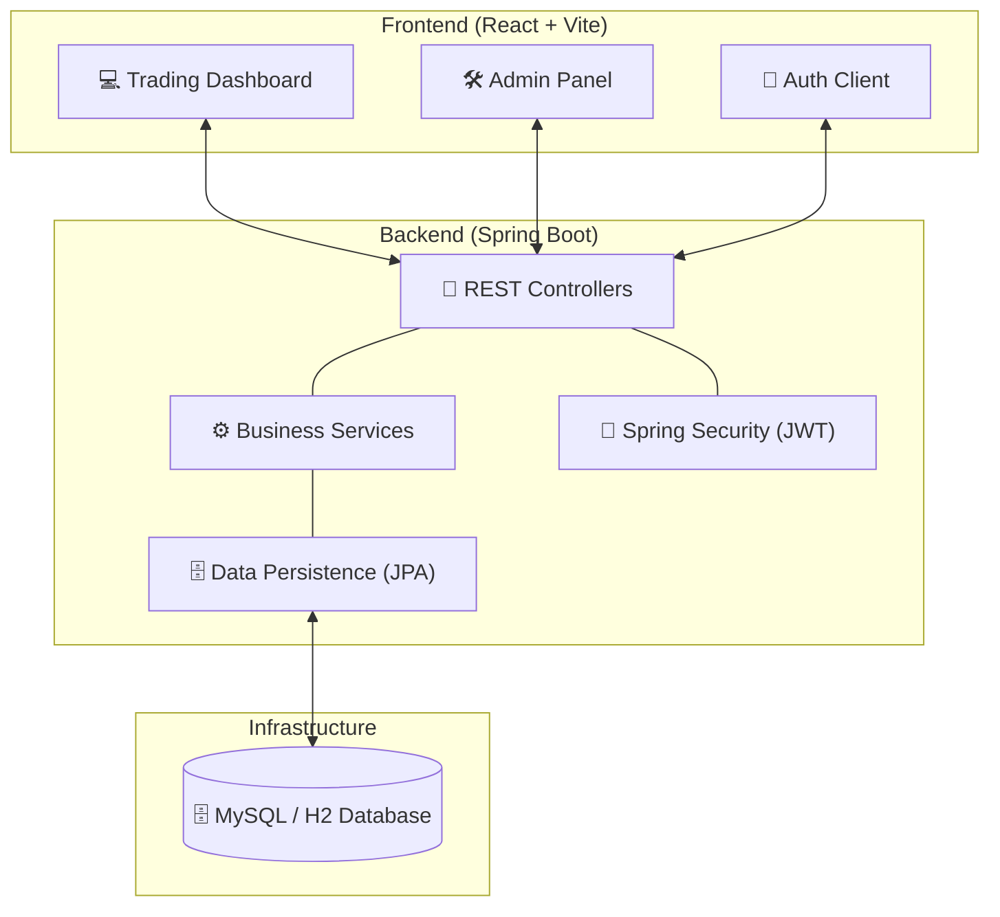
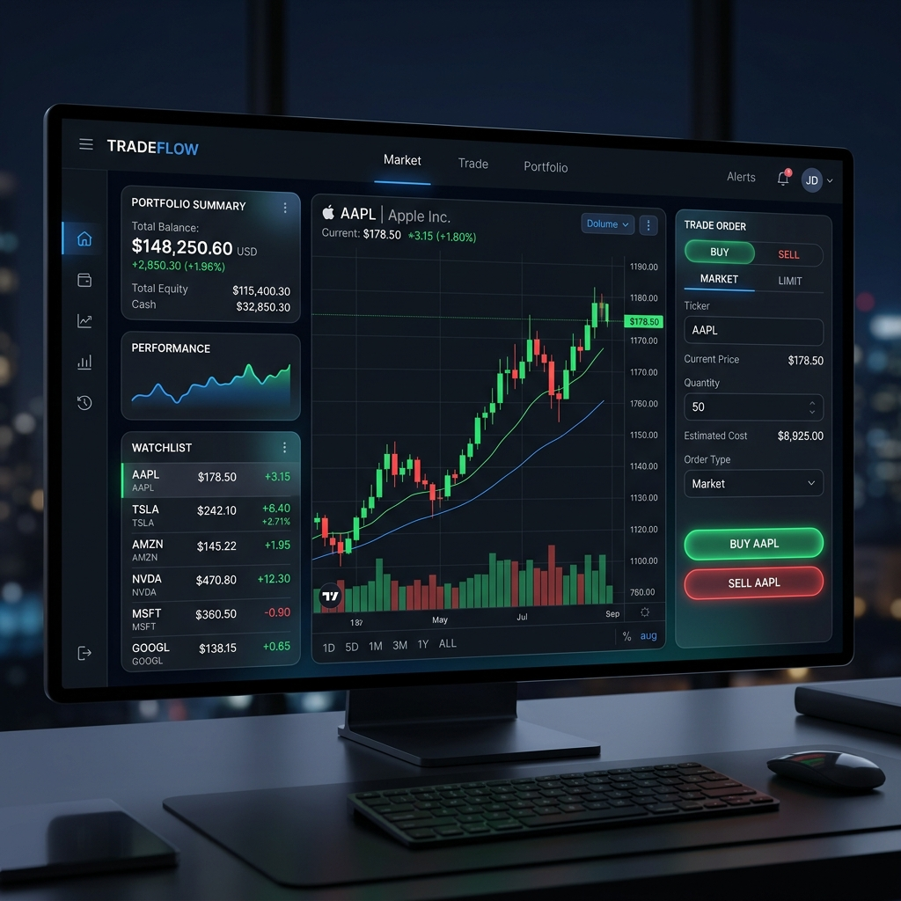
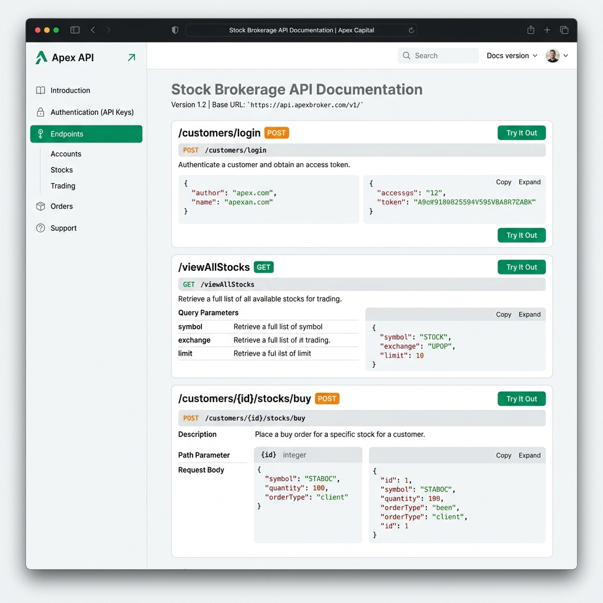

# 📈 Enterprise Stock Brokerage System

[](https://openjdk.org/projects/jdk/17/)
[](https://spring.io/projects/spring-boot)
[](https://reactjs.org/)
[](https://vitejs.dev/)
[](https://www.mysql.com/)

A full-stack, enterprise-grade stock trading platform featuring real-time stock monitoring, portfolio management, secure transaction processing, and a robust admin governance panel.

---

## ✨ Key Features

- **🚀 Real-time Trading Engine**: Execute buy and sell orders with millisecond latency and instant feedback.
- **📊 Interactive Dashboard**: High-fidelity stock price charts and portfolio performance metrics.
- **🔐 Secure Wallet System**: Integrated wallet with support for fund addition, withdrawals, and balance validation.
- **📜 Transaction Auditing**: Comprehensive history of all trades and financial operations.
- **🛠️ Admin Governance**: specialized panel for managing stock listings and overseeing user accounts.
- **🛡️ Robust Exception Handling**: Global error management for a seamless user experience.

---


## 🏗️ System Architecture

The system follows a modern decoupled architecture with a Spring Boot REST API and a React-based single-page application (SPA).



### Core Components
- **Customer Portal:** Allows users to view live stock data, execute buy/sell orders, and manage their investment wallet.
- **Admin Engine:** Provides deep governance tools for managing stock listings, monitoring user activity, and auditing transactions.
- **Transaction Manager:** Ensures ACID compliance for all financial operations, including stock purchases and fund withdrawals.
- **Wallet Service:** Manages virtual currency with strict validation and error handling for insufficient balances.

---

## 🛠️ Technical Stack

| Category | Technology |
| :--- | :--- |
| **Frontend** | React 18, Vite, TailwindCSS, Axios |
| **Backend** | Java 17, Spring Boot 3.2, Spring Security |
| **Persistence** | Hibernate/JPA, MySQL 8, H2 (In-memory) |
| **Build Tools** | Maven, npm |
| **API Docs** | Swagger/OpenAPI |

---

## 🚀 Local Run Guide

### 1. Prerequisites
- **Java 17+** installed.
- **Node.js 18+** installed.
- **MySQL** (Optional, defaults to H2 for quick start).

### 2. Backend Setup
```bash
cd stockbrokersystem
mvn clean install
mvn spring-boot:run
```
*Backend will be running at `http://localhost:8080`*

### 3. Frontend Setup
```bash
cd stock-broker-web
npm install
npm run dev
```
*Frontend will be running at `http://localhost:5173`*

---

## 📡 API Reference

### Authentication
| Method | Endpoint | Description |
| :--- | :--- | :--- |
| `POST` | `/customers` | Register a new customer |
| `POST` | `/login` | Authenticate and get session key |

### Trading Operations
| Method | Endpoint | Description |
| :--- | :--- | :--- |
| `GET` | `/viewAllStocks` | Fetch all available stock listings |
| `POST` | `/customers/{id}/stocks/buy` | Execute a buy order |
| `POST` | `/sellStockByName` | Execute a sell order |
| `GET` | `/customers/{id}/transactions` | View transaction history |

### Wallet Management
| Method | Endpoint | Description |
| :--- | :--- | :--- |
| `POST` | `/addFunds` | Add money to user wallet |
| `POST` | `/withdrawFunds` | Withdraw money from wallet |

---

## 📸 System Previews

### 💹 Trading Dashboard

*A high-fidelity view of the real-time trading interface and portfolio summary.*

### 🔍 API Explorer

*Comprehensive documentation of the RESTful endpoints powering the system.*

---

Developed for secure and scalable financial orchestration.
